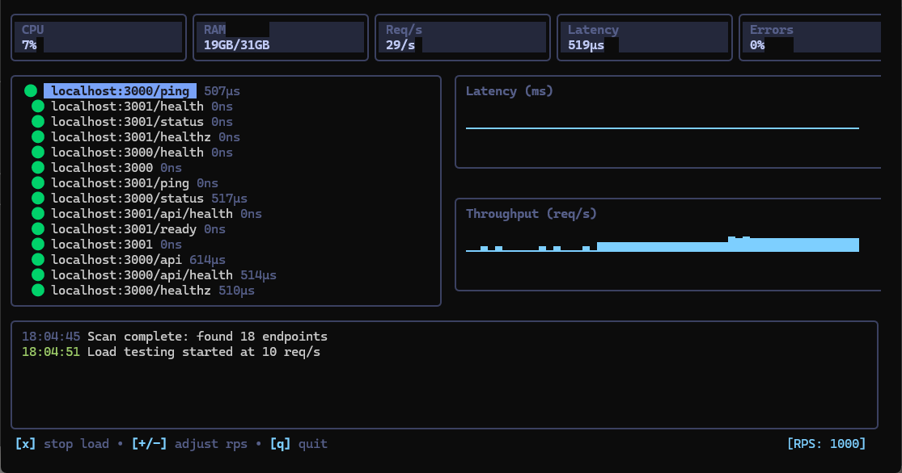

# LocalPulse

Localhost performance checker for developers. Monitor and load test your local endpoints in real-time.




## Install

```bash
go install github.com/Brattlof/localpulse@latest
```

## Usage

```bash
localpulse
```

### Keyboard Shortcuts

| Key | Action |
|-----|--------|
| `r` | Scan for endpoints |
| `s` | Start load testing |
| `x` | Stop load testing |
| `+/-` | Adjust RPS |
| `a` | Add endpoint |
| `d` | Delete endpoint |
| `q` | Quit |

## Features

- **Auto-discovery** — Scans common ports (3000, 8080, 5000, etc.)
- **Real-time metrics** — CPU, RAM, latency percentiles, throughput
- **Load testing** — Configurable concurrent requests
- **Sparkline charts** — Visual performance trends
- **Zero config** — Works out of the box

## Build

```bash
git clone https://github.com/Brattlof/localpulse.git
cd localpulse
go build -o localpulse .
```

## License

MIT
